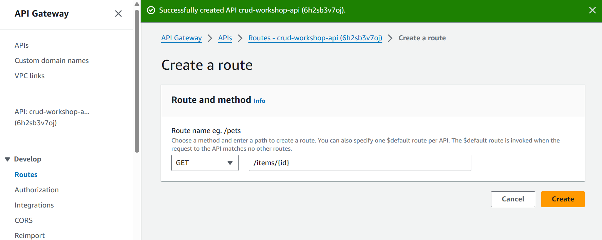
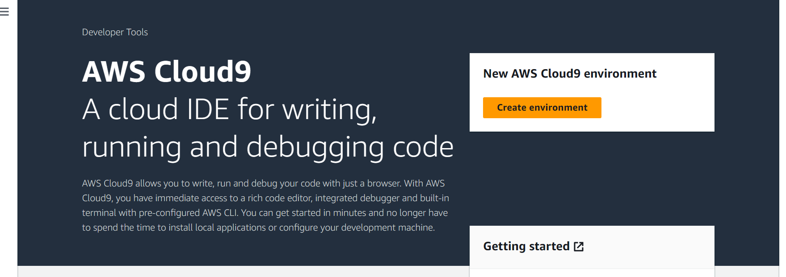

# API Workshop

This is a workshop from the AWS Workshop Studio:

[Build you first CRUD API in 45 minutes or less](https://catalog.us-east-1.prod.workshops.aws/workshops/2c8321cb-812c-45a9-927d-206eea3a500f/en-US/000-gettingstarted)

Your goal in this workshop is to build a very simple CRUD (Create, read, update, delete) API. To accomplish this you will be guided through a few steps. Starting with creating a DynamoDB table using the DynamoDB console, to creating a Lambda function in the AWS Lambda console. Next you will configure an HTTP API using the API Gateway console and last, after launching an AWS Cloud9 IDE you will use it to test your API!


## Contents
- Create a DynamoDB table
- Create a Lambda function
- Create a HTTP API
- Create routes
- Create an integration
- Attach you integration to your routes
- Access to Cloud9
- Test your API
- Clean up

## Create a DynamoDB table
To start off we want to create a table in [DynamoDB](https://docs.aws.amazon.com/amazondynamodb/latest/developerguide/Introduction.html) to store data for our API.

Go to the DynamoDB console and scroll down to _Get started_ and click on __Create table__, alternatively we can do the same by clicking on __Tables__ and select the same option there.


For our table use something like `api-workshop-items` for its name and for our [partition key](https://docs.aws.amazon.com/amazondynamodb/latest/developerguide/HowItWorks.CoreComponents.html#HowItWorks.CoreComponents.PrimaryKey) we'll use `id`. Then click on __Create table__.


## Create a Lambda function
Next we need to create a [Lambda](https://docs.aws.amazon.com/lambda/latest/dg/welcome.html) function that creates, reads, updates, and deletes (CRUD) items from DynamoDB. This function uses events from [API Gateway](https://docs.aws.amazon.com/apigateway/latest/developerguide/http-api-develop-integrations-lambda.html#http-api-develop-integrations-lambda.proxy-format) to determine how to interact with DynamoDB.

Go to the Lambda console in AWS and click on __Create a function__.

 

For creating our function stick to the default option, _Author from scratch_, for our function name we'll use `apiWorkshopFunction` and for runtime and architecture we'll stick to the defaults which are _Node.js 20.x_ and _x86_64_.

Under _Permissions_ select __Create a new role from AWS policy templates__, for role name we'll use `apiWorkshopRole` and under _Policy templates_ use __Simple microservice permissions__.


Click __Create function__.


Next scroll down to the functions _Code source_ editor, under the _Code_ tab.


In __index.mjs__ replace the code above with the following:

```js
// Import the entire AWS SDK package
import AWS from "@aws-sdk/client-dynamodb";

import { GetItemCommand, PutItemCommand, DeleteItemCommand, ScanCommand } from "@aws-sdk/client-dynamodb";

// Destructure the necessary components
const { DynamoDBClient } = AWS;

// Import marhsall
import { marshall } from "@aws-sdk/util-dynamodb";

// Create DynamoDB client
const dynamo = new DynamoDBClient();

// Export handler function
export const handler = async (event, context) => {
  let body;
  let statusCode = 200;
  const headers = {
    "Content-Type": "application/json"
  };

  try {
    switch (event.routeKey) {
      case "DELETE /items/{id}":
        await dynamo.send(new DeleteItemCommand({
          TableName: "api-workshop-items",
          Key: marshall({ id: event.pathParameters.id })
        }));
        body = `Deleted item ${event.pathParameters.id}`;
        break;
      case "GET /items/{id}":
        const getItemOutput = await dynamo.send(new GetItemCommand({
          TableName: "api-workshop-items",
          Key: marshall({ id: event.pathParameters.id })
        }));
        body = getItemOutput.Item;
        break;
      case "GET /items":
        const scanOutput = await dynamo.send(new ScanCommand({
          TableName: "api-workshop-items"
        }));
        body = scanOutput.Items;
        break;
      case "PUT /items":
        const requestJSON = JSON.parse(event.body);
        await dynamo.send(new PutItemCommand({
          TableName: "api-workshop-items",
          Item: marshall({
            id: requestJSON.id,
            price: requestJSON.price,
            name: requestJSON.name
          })
        }));
        body = `Put item ${requestJSON.id}`;
        break;
      default:
        throw new Error(`Unsupported route: "${event.routeKey}"`);
    }
  } catch (err) {
    statusCode = 400;
    body = err.message;
  } finally {
    body = JSON.stringify(body);
  }

  return {
    statusCode,
    body,
    headers
  };
};
```
Then click on _Deploy_ above the editor to update the function.

## Create a HTTP API
The HTTP API provides an HTTP endpoint for your Lambda function. In this step, you create an empty API. In the following steps, you configure routes and integrations to connect your API and your Lambda function.

Head over to the [API Gateway](https://docs.aws.amazon.com/apigateway/latest/developerguide/welcome.html) console to create our HTTP API. In _Create API_ scroll to __HTTP API__ and click on __Build__.


In the following page we will name our API `crud-workshop-api`. Skip the following optional stages for now, in _Review and Create_ click on __Create__.


## Create routes
[Routes](https://docs.aws.amazon.com/apigateway/latest/developerguide/http-api-develop-routes.html) are a way to send incoming API requests to backend resources. Routes consist of two parts: an HTTP method and a resource path, for example, GET /items. For this example API, we create four routes:

__GET__ `/items/{id}`

__GET__ `/items`

__PUT__ `/items`

__DELETE__ `/items/{id}`

In the API Gateway console, we'll select the API we created as part of the workshop and navigate to _Routes_ (can be found in the panel on the left-hand side unless there already), then click on __Create__. 

On the next page click on the dropdown and select the desired method (in this case we select __GET__ and enter `/items/{id}` as the path) then click on __Create__ and repeat this for the remaining routes above.



Our API routes should look as follows:


## Create an integration
You create an [integration](https://docs.aws.amazon.com/apigateway/latest/developerguide/http-api-develop-integrations-http.html) to connect a route to backend resources. At a later step you will attach these integrations to a route. For this example API, you create one Lambda integration that you use for all routes.

Now we go back to our API but this time we'll navigate to _Integrations_ (seek in left-hand side panel). Select _Manage integrations_ then click on __Create__. For now we'll skip the first option to attach integration to a route since this part is covered in a later step in the workshop. For _Integration target_ select __Lambda function__ and then select our lambda arn under _Integration details_.


Click on __Create__.


## Attach your integration to routes
For this example API, you use the same AWS Lambda integration  for all routes, so in essence a monolithic application. Monoliths work well for the simplest serverless applications that perform single-purpose functions.

After you attach the integration to all of the API's routes, your Lambda function is invoked when a client calls any of your routes.

To attach integrations to routes we switch over to _Attach integrations to routes_ under _Integrations_ in our workshop API.


Select a route and you will be presented with two options which are to create and then attach an integration, or to simply choose an existing integration to attach to the route. We've already created the integration so simply select the _Choose an existing integration_ dropdown and select the integration we created then click on __Attach integration__. Repeat this step for all routes and we should see the following:


## Access to Cloud9
All thats left is to test our API, but first we want to setup our Cloud9 envrionment to do this.

In the AWS console, navigte to AWS Cloud9 and select __Create environment__.



Name the environment `api-workshop` and then for configurations select to run the environment on an EC2 instance (for settings I'll use t2.micro and will select Amazon Linux 2023 as the platform).


Note creation of the envrionment may take a few minutes, once created open up the __Cloud9 IDE__ for the api-workshop environment.


We can open a new terminal by selecting the `+` symbol if once hasn't already opened for us. Now we are ready to test our API!

## Test your API
To make sure that your API is working, you use curl, a command line tool and library for transferring data with URLs.

First lets head back to our API in API Gateway, navigate to _Stages_ select the default stage that was created with our API and make note of the __Invoke URL__.


Copy the URL and navigate back to the Cloud9 IDE to set a variable as shown below:


Now lets create or update an item in our DynamoDB table.

execute the following command in the IDE:

```
curl -X "PUT" -H "Content-Type: application/json" -d "{
    \"id\": \"abcdef234\",
    \"price\": 12345,
    \"name\": \"myitem\"
}" $INVOKE_URL/items
```

If successful we should see the following output:
```
"Put item abcdef234"
```

To verify we'll go to our table in DynamoDB, select __Explore table items__, then scroll down and we should see our item.


Great! We have verified that our API works as expected! Lets carry out a few more tests to ensure our other routes and integrations work.

To get all items run the following command:
```
curl -s $INVOKE_URL/items | js-beautify 
```

The output should be:
```
[{
    "price": {
        "N": "12345"
    },
    "id": {
        "S": "abcdef234"
    },
    "name": {
        "S": "myitem"
    }
}]
```

To get a single item adjust the command to:
```
curl -s $INVOKE_URL/items/abcdef234 | js-beautify
```

To delete an item run the following:
```
curl -X "DELETE" $INVOKE_URL/items/abcdef234
```

Should get the output
```
"Deleted item abcdef234"
```

And we can even verify by using the get command or checking the items in the DynamoDB table.

## Clean up!
And there we have it! Workshop complete!

To avoid unnecessary costs delete all the resources created: DynamoDB table, Lambda function, HTTP API, Cloud9 environment, and all other associated resources.

## Challenge
A good challenge here would be to try and replicate this in IaC through something like Terraform to spinup and bring down the resources whenever we want with ease! 

Will create a `tf/` directory to contain my Terraform configuration for this workshop and once that is complete I can look to build on improving the infrastructure of the workshop.