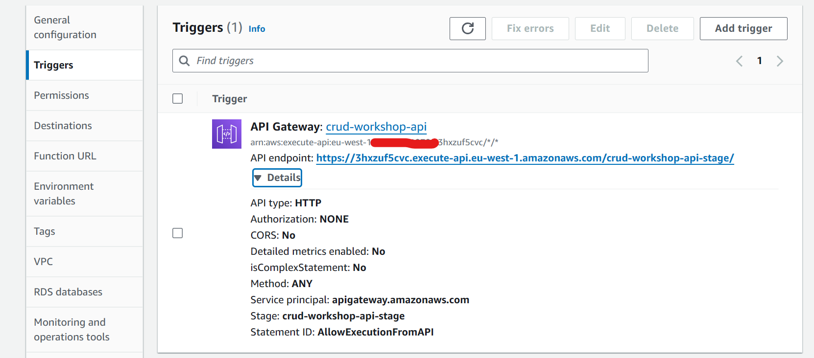

# API Workshop with Terraform

This is the terraform directory for the API workshop, I followed the same steps as I did in the AWS console when completing the workshop, here's a quick runthrough of the contents and which files cover which part:

#### Create a  DynamoDB table
This particularly was as straightforward as in the console workshop. Here is our DynamoDB table resource in `dynamodb.tf`:
```js
resource "aws_dynamodb_table" "my_table" {
  name           = "api-workshop-items"
  hash_key       = "id"
  read_capacity  = 20
  write_capacity = 20

  attribute {
    name = "id"
    type = "S"
  }
}
```
#### Create a Lambda function
Not as straightforward as with our DynamoDB as there are several other parts to cover not just the Lambda function the resource of which was created in `lambda.tf`:
```js
resource "aws_lambda_function" "my_lambda" {
  filename      = data.archive_file.lambda.output_path
  function_name = "api-workshop-function"
  role          = aws_iam_role.iam_for_lambda.arn
  handler       = "index.handler"

  source_code_hash = data.archive_file.lambda.output_base64sha256

  runtime = "nodejs20.x"
}
```
For the arguments `filename` and `role` you can find the resources covering these in `data.tf` and `iam.tf` respectively, the lambda code itself can be found in the `files` directory. Its important that we ensure our function has the correct permissions for everything to work properly, and I don't just mean regarding the interactions between our function and our DynamoDB table, Lambda functions by default usually come with permissions to interact with CloudWatch, this comes in really handy when troubleshooting, if you need it and don't have it then troubleshooting any issues becomes a pain!

#### Create a HTTP API, routes, integrations
For the HTTP API we have several resources we need to create alongside the API itself similarly to what we did in the console workshop, all this is covered in the `api.tf` file, we start by creating the API resource, note that the HTTP API is an API Gateway v2 resource so the resources we want are all prefixed by `aws_apigatewayv2_`:
```js
resource "aws_apigatewayv2_api" "my_api" {
  name          = "crud-workshop-api"
  protocol_type = "HTTP"
}
``` 
For creating the routes:
```js
resource "aws_apigatewayv2_route" "get_items" {
  api_id    = aws_apigatewayv2_api.my_api.id
  route_key = "GET /items"
  target    = "integrations/${aws_apigatewayv2_integration.lambda_integration.id}"
}
```
We have 4 routes in total, so we should have 4 separate resources for each of the routes we created in the workshop, and the `target` argument covers the step of attaching our integration to our routes, of course you will need to create the following `aws_apigatewayv2_integration` resource:
```js
resource "aws_apigatewayv2_integration" "lambda_integration" {
  api_id                 = aws_apigatewayv2_api.my_api.id
  integration_type       = "AWS_PROXY"
  integration_uri        = aws_lambda_function.my_lambda.invoke_arn
  payload_format_version = "2.0"
}
```

#### Additional resources
Whilst everything above more or less covers what we did in the workshop (except for Cloud9 I tested from my local machine), I couldn't get my API to work as it did before so I created the following resources:
```js
resource "aws_apigatewayv2_stage" "my_api_stage" {
  api_id      = aws_apigatewayv2_api.my_api.id
  name        = "crud-workshop-api-stage"
  auto_deploy = true
}
```
You may recall that a default stage was automatically created when we were going through the console, of course we selected the option to have it created but we didn't interact with it so initially I didn't create my own stage and found that my API wasn't deployed to one (because I didn't have a stage created...duh). You can find the resource in the `api.tf` file with the other API related resources.

I was also struggling to invoke my function, I don't know why but it appears when I was making my API calls my Lambda function wasn't even getting invoked, so to fix this I created an `aws_lambda_permission` resource for my API, which would allow my API to invoke my Lambda function, this can be found in `lambda.tf`:
```js
resource "aws_lambda_permission" "api" {
  statement_id = "AllowExecutionFromAPI"
  action = "lambda:InvokeFunction"
  function_name = aws_lambda_function.my_lambda.function_name
  principal = "apigateway.amazonaws.com"
  source_arn = "${aws_apigatewayv2_api.my_api.execution_arn}/*/*"
}
```
After adding this I noticed that my HTTP API now appeared as a trigger for my Lamba function.


And there we have it, now test as we did before, you can take the extra step and create a Cloud9 environment through terraform or just simply test using your local machine.

#### Get testing
Once ready to deploy your Terraform infrastructure run the following:
```sh
terraform init
terraform plan
terraform apply  # use --auto-approve to skip approval - same for destroy
terraform destroy # for when you are done and want to save on costs
```
Ensure that the AWS provider is set
```js
terraform {
  required_providers {
    aws = {
      source  = "hashicorp/aws"
      version = "~> 5.0"
    }
  }
}

# Configure the AWS Provider
provider "aws" {
  region = var.region // whatever your region is
}
```
Also to make testing easier, since you may spin up and tear down your infrastructure regularly whilst testing things out your API invoke URL will change all the time so for ease create a new file `outputs.f` and create the following output block
```js
output "api_invoke_url" {
  value = aws_apigatewayv2_stage.my_api_stage.invoke_url
}
```
Now when you run terraform apply in the console it will spit out something like:
```
Outputs:

api_invoke_url = "https://3hxzuf5cvc.execute-api.eu-west-1.amazonaws.com/crud-workshop-api-stage"
```
Just copy the `api_invoke_url` to input into your curl commands when testing your API.

## Useful link
If you aren't that familiar with Terraform I strongly advise that you refer to the official documentation which can be found at [HashiCorp Terraform Registry](https://registry.terraform.io/providers/hashicorp/aws/latest/docs)